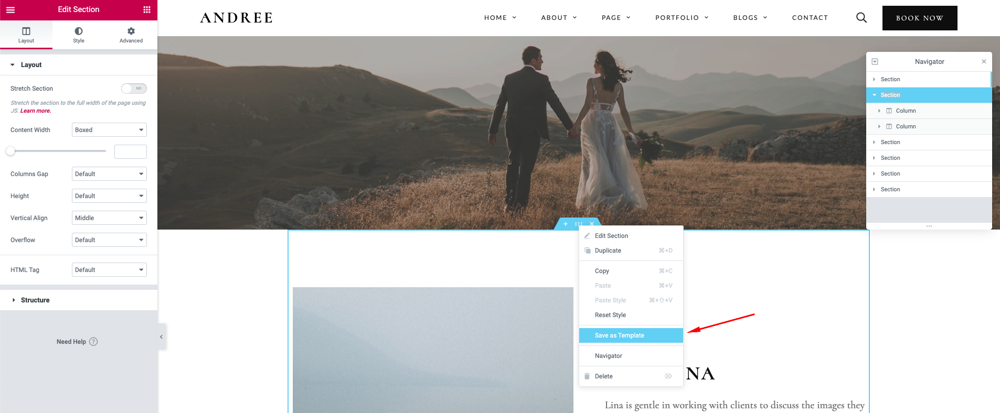
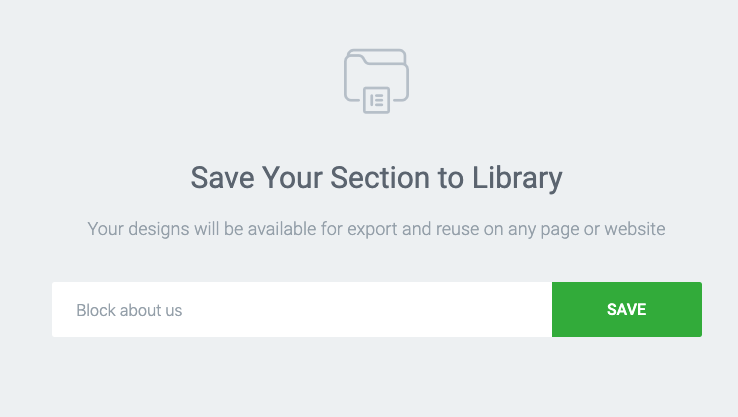
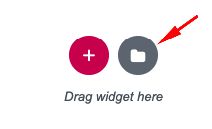
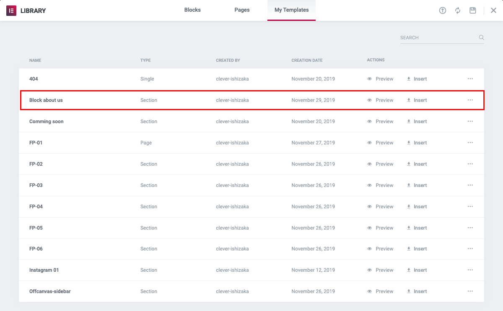
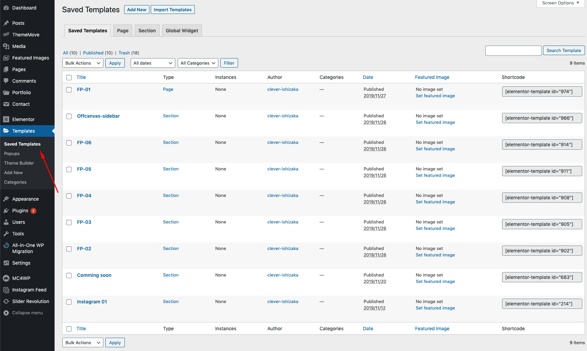
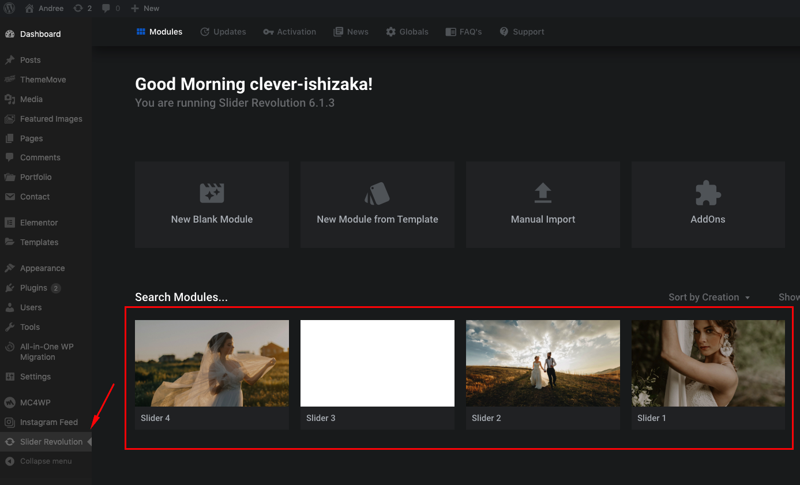
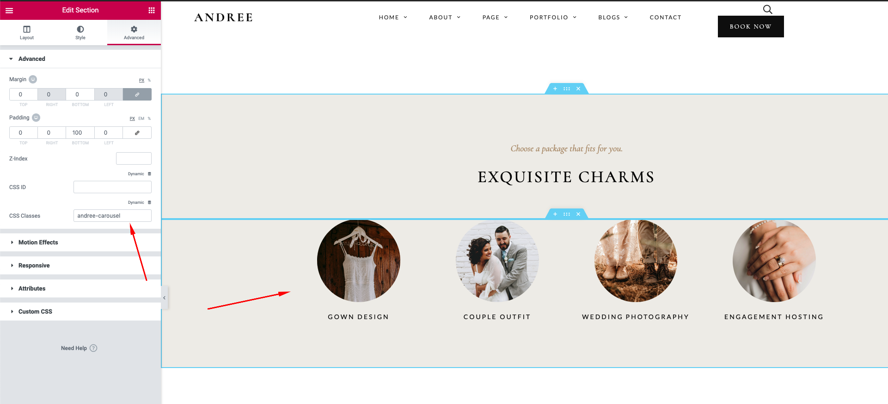
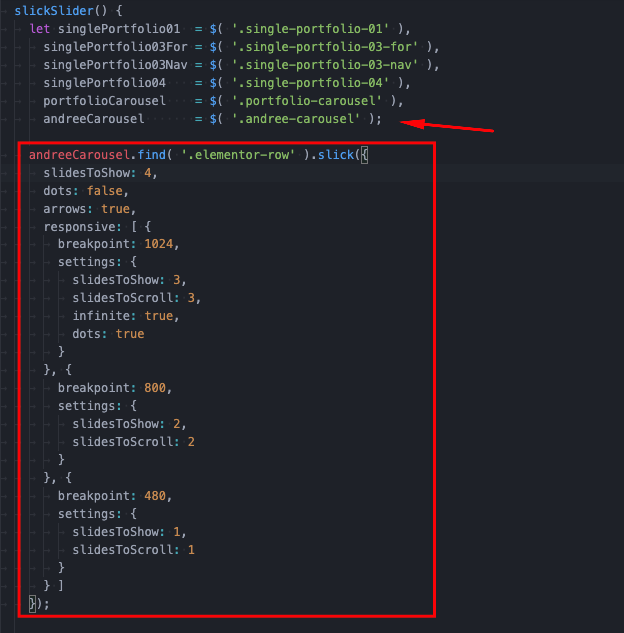

# Page

In this part, I’ll guide you through creating a simple page using Elementor page builder and Slider Revolution plugin.

[Elementor](https://elementor.com/) is one of the most widely used page-building plugins popular among WordPress users. There are two versions for this: Elementor and Elementor Pro. In Andree, we integrated Elementor Pro so that users can use it for free. The update of this plugin is conducted alongside updating Andree theme. For more information, kindly refer to this [link](https://docs.elementor.com/)

## How to create a new page with Elementor

**Step 1:** Create a new page  
•	Pages > Add New  
•	Enter the page title  
•	Navigate to Page Options if you want to setting private  
•	Click on Edit with Elementor

---

**Step 2:** Drag and drop appropriate widgets into the new page, you can also use the Navigator and arrange them to the right hand sidebar. After edit page, hit **Publish Page.**  See more in [video](https://www.youtube.com/watch?v=xYrvjaSJH_M&t=487s)

## Using template

Users can also save Elementor widgets from Andree demo as templates and reuse these templates in their new page. To do this, select Edit a specific demo page, choose a widget by clicking on Customize icon then **Save as Template.**  

---

Rename the new template for later use.

---

Now, users are able to place the new templates in any position in a page, post, product, popup, etc. You can do that by clicking on the document icon, choose My templates then hit the Insert button.

---

To manage these templates, please go to **Templates >> Saved** Templates, we used these templates and shortcodes to make a product tab carousel. (Category #01, Category #02, Category #03)

## Slider Revolution

**Slider Revolution:** To use the slider creator, find Slider Revolution from the admin dashboard. Users can add a new slider, duplicate or edit an existing slider in the demo. For more instructions, read [here](https://www.themepunch.com/support-center/). It’s possible to create a new slider by using the widget **'Slider Revolution'** in Elementor or using their shortcode ID.

## Custom Class

**Custom Class:** Andree relies on custom class for performance and quick styling. Make sure you preserve the custom class when you reuse an element or copy an element to paste in another place. Custom classes can be found in **Advanced >> CSS** Classes of each element or row.

---

Users are able to customize the configurations of sliders by view the code in **main.js**. We recommend that you fix this file in the child theme. To make necessary adjustments, please find the custom classes of the selected slider in this file. Read more in [here](https://kenwheeler.github.io/slick/). If you should need further help, feel free to [contact us](https://thememove.ticksy.com/), we’re glad to help you out. 🤗

